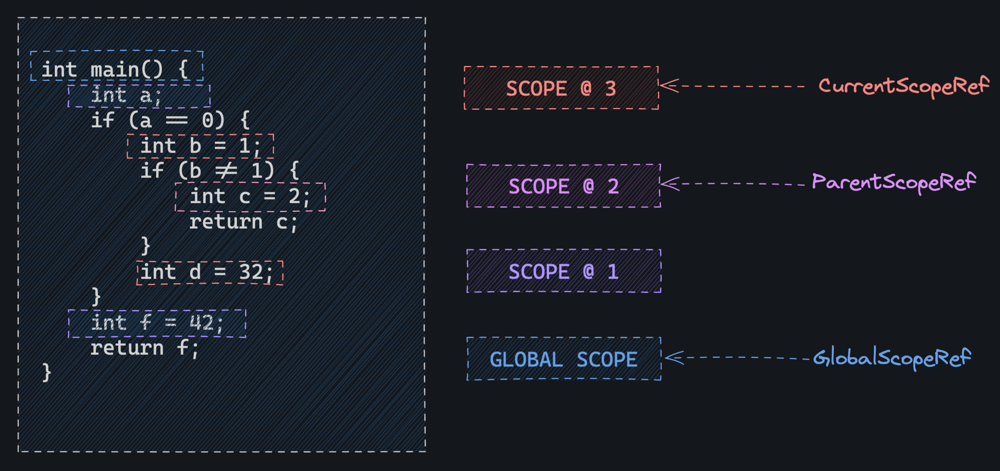

# Frontend: Design of the scanner, parser and semantic analyzer.

## Tokenization and AST construction.

The scanner in `glouton` is a very simple LL1 lexical analyzer that iterates
over the input and builds a list of tokens. Since we are expecting most inputs
to be fairly small (10 ~ 1000 LOC) no attention was paid to its design.

The parser in `glouton` on the other hand is slightly different, it uses Pratt
style approach to parsing expressions and uses a flattened AST representation.

The flat AST representation comes in three layers of `Vec`s each layer is has
references to objects in the following layer or at the same layer.

```

decls: Vec<Stmt>
stmts: Vec<Stmt>
exprs: Vec<Expr>

```

The first layer `decls` is used to store top level declarations in the program
since our input language is C-like these are variables and functions.

The second layer `stmts` is a pool of all stmts in the program, whereas `decls`
holds `enum::Stmt::VarDecl | enum::Stmt::FuncDecl` with references in the pool
of`stmts` objects in the `stmts` pool can hold backwards references.

The last layer `exprs` is a pool of all expressions in the program, where all
references flow backwards. For example `x + y` would be laid out in the `exprs`
pool as such :

```

x_ref, y_ref, bin_op{add,x_ref, y_ref}

```

Walking the AST must start from the declarations slice and can recurisvely
visit the statements and expressions.

Consider for example this block of code :

```c

int main() {
    int i = 0;
    int x = i;
    int z = x + i;
}

```

This AST would be laid out as such :

```

decls: [FuncDecl(name:str, ret:type, args:Vec<StmtRef>, body: StmtRef[0]]
stmts: [VarDecl(i, 0), VarDecl(x, 0), VarDecl(z, ExprRef[2])]
exprs: [Named(x), Named(y), Add(ExprRef[0], ExprRef[1])]

```


This data oriented approach has several pros, the first being that arenas
are borrow checker friendly. This is especially important in Rust where
an initial design might be invalidated because it doesn't have a borrow
checker friendly representation.

The second argument for this is that complex self references and circular
references are not an issue anymore because there is no lifetime associated
with the reference you use, the lifetime is now associated with the entire
arena and the individual entries hold indices into the arena which are just
`usize`.

Another argument although less impressive at this scale is speed, because
fetches aren't done via pointers and because AST nodes have nice locality
if your arena fits in cache then walking it becomes much faster than going
through the pointer fetch road. There is also no allocations in the hot path.

One downside of this representation is that it requires being careful when
implementing consumers of the AST. This comes from the fact that the AST
is constructed bottom-up and so all child leafs will be located before
their parents in the flat representation (at least at the second two layers).

## Semantic Analysis

Semantic analysis in Glouton is implemented in multiple passes, starting with
a declaration analysis pass that builds a symbol table of all identifiers
in the AST.

The symbol table is implemented as a "virtual" stack of hashmaps, virtual in
the sense that no "poping" is done, instead a pointer is used to simulate FIFO
behavior we want.

Starting from the global scope, the symbol table is initiatlized with an empty
stack i.e `vec![HashMap::new()]` this top level hashmap contains all identifiers
in the global scope.

Each time we encounter a new scope (indicated by a curly brace '{' in source)
we push a new `HashMap` to the stack, increment `CurrentScopeRef`, change 
`ParentScopeRef` to the old value of `CurrentScopeRef` and continue processing symbols.

When we leave a scope (indicated by a curly brace '}' in source) we set 
`CurrentScopeRef` to `ParentScopeRef` and decrement the latter.



After finishing processing declarations a new pass is initialized which uses
the recently built symbol table to validate the program static semantics :

* Every name reference must resolve to an existing symbol.
* Names can't be re-defined within the same block.
* Functions can't be declared outside the global scope.
* Variables defined in an inner scope shadow the ones defined in outer scopes.
* All operators and functions are used with the correct number of arguments
  and of the correct type.
* Functions must end with a `return` statement unless they have type `void`.
* Every variable must be declared with a type.
* Function parameters and locally declared variables with overlapping scopes
  must not have the same name.
* Functions may not be declared more not be declared more than once even with
  different return type and arguments.
* Once function must be declarated with the name `main` and return type `int`.
* `void` is only allowed as a return type.

